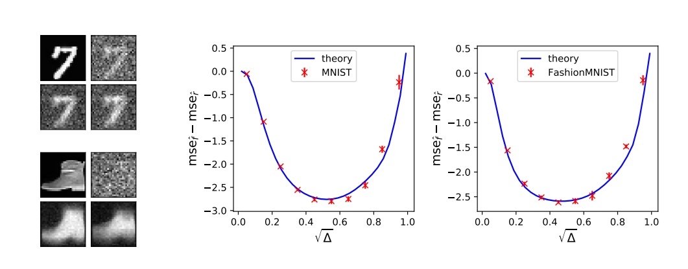

# DAE

Code for the paper : <i>High-dimensional Asymptotics of Denoising Autoencoders</i> (<a href="https://proceedings.neurips.cc/paper_files/paper/2023/hash/2722a0ccf6acfe3d144fdbb0dedd80b5-Abstract-Conference.html">link to paper</a>)

<p align="center"></center></p>

## Theoretical characterization
(Figs. 1 - 3, solide lines)
- <tt>Theory.ipynb</tt> provides a Jupyter notebook implementation of equations (13) for $K=2, p=1$, returning a sharp theoretical characterization for the denoising test mean-squared error and associated summary statistics. The statistics of the data distribution can be specified in the variables $\mu,\Sigma p,\Sigma m$. 


## Simulations 
(Figs. 1 - 3, dots)
- <tt>simulations.py</tt> contains a <tt>Pytorch</tt> implementation of the related numerical experiments, for synthetic Gaussian mixture data.
- <tt>simulations_MNIST.py</tt> contains a similar implementation for the MNIST dataset, see Fig. 2. To train on the FashionMNIST dataset, simply change the loading to
  ```
  mnist_trainset= datasets.FashionMNIST(root='data', train=True, download=True, transform=None)
  ```


<b> Versions:</b> These notebooks employ <tt>Python 3.12 </tt>, and <tt>Pytorch 2.5</tt>. The theory code utilizes the <tt>quadpy</tt> package for multidimensional numerical integration. This scheme is not adaptative, and convergence issues may appear e.g. for large cluster variance $\sigma \gtrsim 1$ for binary mixtures. 
